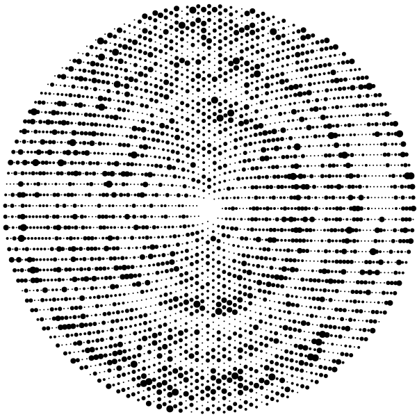

# multiplicative-persistence

[](https://circleci.com/gh/tommilligan/multiplicative-persistence)

Search for integers with high multiplicative persistence values.

## Installation

This project uses the standard `rustup` and `cargo` toolchain. Originally tested against `rustc 1.33.0`.

By default the library uses `num-bigint` internally. This can be swapped for `ramp` as a dependency by specifying:

```
multiplicative-persistence = { version = "*", features = ["backend-ramp"], default-features = false }
```

Or as a binary by building with:

```bash
cargo +nightly build --no-default-features --features backend-ramp
```

## Usage

Build binaries with `cargo build --release --bins`, they will be output in `target/release`:

- `mpersist`
  - `for`: get the multiplicative persistence of any positive integer
  - `list`: get the multiplicative persistence of values in a range
  - `search`: look for the smallest integer with the largest multiplicative persistence value
- `mp-visualize`

### Data generation

```bash
./mpersist for 12     # 1
./mpersist -- for 77  # 4
```

```bash
./mpersist search
3 39
4 77
# etc.

# Search for mp values
# - starting with integers 233 digits in length
# - search for 10 rounds (i.e. search up to 243 digits in length)
# - use 4 threads
./mpersist search -f 233 -n 10 -t 4
# this might take some time!
```

### Visualization

For visualization examples, see the [example](example/) directory.
The `mp-visualize` binary reads the output of `mpersist list` from stdin, and lays it out in a [Sacks spiral](https://en.wikipedia.org/wiki/Ulam_spiral#Variants).

```bash
./mpersist list 0 3500 | ./mp-visualize default.png
./mpersist list 0 100000 | ./mp-visualize -d 0.5 -a 0.25 -r 4 -f 2.0 -w 900 shockwave.png
./mpersist list 0 25000 | ./mp-visualize -d 0.25 -a 0.25 -r 3.5 stars.png
```



> A visualisation of the first 3500 integers and their mp values
